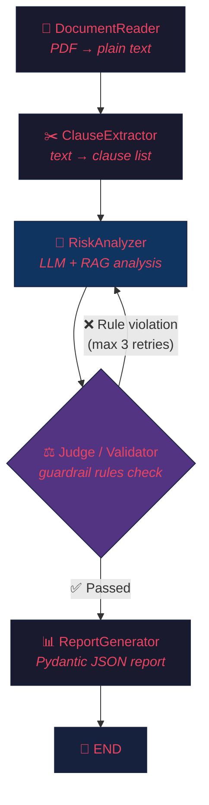

<div align="center">

# 🔍 Smart Contract Audit System

**AI-powered contract analysis using LangGraph multi-agent orchestration, RAG, and semantic guardrails.**

[](https://github.com/Furknstr/SmartContract/actions)


*Upload a PDF contract → Get a structured risk report in seconds.*

</div>

---

## 📋 Overview

The **Smart Contract Audit System** reduces contract review time from hours to minutes. Upload a contract (PDF), and the system will:

1. **Read** the document and extract text (PyMuPDF)
2. **Split** the text into logical clauses (regex-based segmentation)
3. **Analyse** each clause for risk using an LLM + RAG comparison against standard clauses
4. **Validate** findings through a deterministic guardrail layer (no LLM involved)
5. **Generate** a structured, Pydantic-validated JSON report

Every risk finding is backed by both a **RAG source** (semantic similarity to standard clauses from [CUAD](https://www.atticusprojectai.org/cuad)) and **rule-based validation** — the system doesn't just say "trust me."

---

## 🏗️ Architecture

The pipeline is built as a **LangGraph state graph** with a cyclic feedback loop between the Judge and RiskAnalyzer:



**Key design decision:** The Judge→RiskAnalyzer loop is the most distinctive feature. When the deterministic guardrail layer detects that the LLM under-rated a risk (e.g., rated "low" when the rule requires "high"), it sends the clause back with specific feedback. This cyclic state management is LangGraph's superpower over simple chains.

---

## 🛠️ Tech Stack

| Layer | Technology | Purpose |
|-------|-----------|---------|
| **Orchestration** | [LangGraph](https://github.com/langchain-ai/langgraph) | Multi-agent pipeline with cyclic state graph |
| **LLM** | [Ollama](https://ollama.ai) (Qwen2.5-7B) | Local inference — no API keys required |
| **Vector DB** | [ChromaDB](https://www.trychroma.com) | RAG storage for standard clause embeddings |
| **SQL DB** | [PostgreSQL 16](https://www.postgresql.org) | Audit report storage and document metadata |
| **API** | [FastAPI](https://fastapi.tiangolo.com) | REST API with auto-generated OpenAPI docs |
| **Validation** | [Pydantic v2](https://docs.pydantic.dev) | Strict output schema enforcement |
| **PDF Parsing** | [PyMuPDF](https://pymupdf.readthedocs.io) | Fast text extraction from PDF files |
| **Observability** | [LangSmith](https://smith.langchain.com) | Visual trace debugging for agent flows |
| **Data** | [CUAD v1](https://www.atticusprojectai.org/cuad) | 500+ real contracts for RAG reference set |
| **CI/CD** | [GitHub Actions](https://github.com/features/actions) | Automated linting, testing on every push |
| **Containerisation** | [Docker Compose](https://docs.docker.com/compose) | One-command infrastructure setup |

---

## ✨ Features

- **Multi-agent pipeline** — 5 specialised LangGraph agents with shared state
- **Cyclic feedback loop** — Judge sends clauses back to RiskAnalyzer for re-analysis (up to 3 retries)
- **RAG-enhanced analysis** — Each clause is compared against ~1,200 standard clauses from CUAD via ChromaDB
- **Deterministic guardrails** — YAML-configured rules that catch hallucinations without calling the LLM
- **Graceful degradation** — Works in keyword-fallback mode when Ollama/ChromaDB are unavailable
- **Pydantic-validated output** — Structured `ContractReport` schema with risk scores
- **SQL audit logging** — Every analysis is persisted in PostgreSQL
- **LangSmith tracing** — Optional visual debugging for the entire agent pipeline
- **Automated CI/CD** — Ruff linting, formatting checks, and pytest on every push

---

## 📁 Project Structure

```
smart-contract-audit/
├── api/
│   ├── main.py                         # FastAPI application + endpoints
│   ├── agents/
│   │   ├── graph.py                    # LangGraph state graph definition
│   │   ├── document_reader.py          # PDF → plain text (PyMuPDF)
│   │   ├── clause_extractor.py         # Text → clause list (regex)
│   │   ├── risk_analyzer.py            # LLM + RAG risk assessment
│   │   ├── judge.py                    # Deterministic guardrail validator
│   │   └── report_generator.py         # Pydantic report builder
│   └── schemas/
│       └── contract_schema.py          # ClauseRisk + ContractReport models
├── rag/
│   ├── ingestion.py                    # CUAD dataset → ChromaDB loader
│   └── vectorstore.py                  # ChromaDB client management
├── db/
│   ├── models.py                       # SQLAlchemy ORM (Document, Report)
│   └── session.py                      # Database session factory
├── guardrails/
│   └── rules.yaml                      # Deterministic validation rules
├── evaluation/
│   ├── evaluate_precision_recall.py    # CUAD-based precision/recall scorer
│   ├── clause_type_map.py              # CUAD → system clause type mapping
│   └── results/                        # Generated evaluation reports
├── data/
│   ├── prepare_test_set.py             # CUAD test set preparation script
│   └── test_set/                       # Ground truth labeled contracts
├── tests/
│   ├── conftest.py                     # Shared pytest fixtures
│   └── test_agents.py                  # Unit tests (no external services)
├── .github/workflows/
│   └── main.yml                        # CI/CD pipeline (lint + test)
├── docker-compose.yml                  # PostgreSQL + ChromaDB containers
├── langsmith_config.py                 # LangSmith tracing setup
├── pyproject.toml                      # Dependencies + tool configuration
├── .env.example                        # Environment variable template
└── README.md
```

---

## 🚀 Quick Start

### Prerequisites

- **Python 3.11+**
- **Docker** and **Docker Compose**
- **Ollama** ([install guide](https://ollama.ai))

### 1. Clone and configure

```bash
git clone https://github.com/Furknstr/SmartContract.git
cd SmartContract

# Copy environment template and edit as needed
cp .env.example .env
```

### 2. Start infrastructure

```bash
# Start PostgreSQL and ChromaDB containers
docker compose up -d

# Pull the LLM model (runs natively — not in Docker)
ollama pull qwen2.5:7b
```

### 3. Install dependencies

```bash
# Using uv (recommended)
uv sync

# Or using pip
pip install -e .
```

### 4. Load the RAG reference set

```bash
# Downloads CUAD v1 and loads ~1,200 standard clauses into ChromaDB
uv run python -m rag.ingestion
```

### 5. Run the API

```bash
uv run uvicorn api.main:app --reload --host 0.0.0.0 --port 8000
```

The API is now available at **http://localhost:8000** with interactive docs at **/docs**.

### 6. Analyse a contract

```bash
# Upload a PDF
curl -X POST http://localhost:8000/upload-and-analyze \
  -F "file=@your_contract.pdf"

# Or use the test endpoint (dummy text)
curl -X POST http://localhost:8000/analyze \
  -H "Content-Type: application/json" \
  -d '{"document_name": "test_contract.pdf"}'
```

---

## 📡 API Reference

| Method | Endpoint | Description |
|--------|----------|-------------|
| `GET` | `/` | Health check — confirms the API is running |
| `POST` | `/upload-and-analyze` | Upload a PDF file and run the full analysis pipeline |
| `POST` | `/analyze` | Run the pipeline with built-in dummy text (for testing) |

### Example Response

```json
{
  "status": "success",
  "report": {
    "document_name": "service_agreement.pdf",
    "total_clauses": 12,
    "risky_clauses": [
      {
        "clause_id": "clause_003",
        "clause_text": "Termination notice must be given 5 days in advance.",
        "risk_level": "high",
        "explanation": "The termination notice period is below the standard 30-day minimum.",
        "recommendation": "Extend the notice period to at least 30 days.",
        "matched_rule": "llm_analysis::termination"
      }
    ],
    "overall_risk_score": 0.4583,
    "generated_at": "2026-07-30T12:00:00"
  }
}
```

---

## ⚖️ Guardrail Rules

The Judge agent validates LLM output against deterministic rules defined in [`guardrails/rules.yaml`](guardrails/rules.yaml). No LLM is involved — this layer is fast and hallucination-proof.

```yaml
rules:
  - id: "termination_notice_minimum"
    clause_type: "termination"
    check: "notice_period_days >= 15"
    severity: "high"
    message: "The termination notice period is below the legal minimum (15 days)."

  - id: "penalty_clause_missing"
    clause_type: "penalty"
    check: "clause_present == true"
    severity: "medium"
    message: "No penalty clause was found in the contract."

  - id: "no_liability_cap"
    clause_type: "liability"
    check: "cap_amount is not null"
    severity: "high"
    message: "No upper cap on liability has been specified."
```

If the LLM rates a clause as "low" risk but a guardrail rule says it should be "high", the Judge **sends it back** to the RiskAnalyzer with specific feedback — triggering the cyclic loop.

---

## 📈 Evaluation

The system is evaluated against the [CUAD](https://www.atticusprojectai.org/cuad) dataset using precision, recall, and F1 metrics:

```bash
# Prepare the test set (15 contracts with ground truth labels)
uv run python -m data.prepare_test_set

# Run the evaluation
uv run python -m evaluation.evaluate_precision_recall
```

---

## 🔭 LangSmith Tracing

[LangSmith](https://smith.langchain.com) provides visual debugging for the entire agent pipeline. You can see exactly which node ran, what state it received, what it returned, and how long each step took.

### Setup

1. Sign up at [smith.langchain.com](https://smith.langchain.com) (free tier available)
2. Generate an API key
3. Uncomment and fill in the LangSmith variables in your `.env`:

```env
LANGCHAIN_TRACING_V2=true
LANGCHAIN_API_KEY=<your-api-key>
LANGCHAIN_PROJECT=smart-contract-audit
```

4. Restart the API — traces will appear in your LangSmith dashboard automatically

### What you'll see

- **Full pipeline trace** — every node in the graph with inputs/outputs
- **Timing breakdown** — how long each agent took (useful for identifying bottlenecks)
- **Retry visibility** — see exactly when the Judge sends a clause back to RiskAnalyzer and why
- **LLM prompts/responses** — the exact prompts sent to Ollama and the raw responses

> Tracing is **completely optional** — the system runs normally without it.

---

## 🧪 Running Tests

```bash
# Install dev dependencies
uv sync --dev

# Run all tests
uv run pytest tests/ -v

# Run with coverage
uv run pytest tests/ -v --tb=short

# Lint
uv run ruff check .

# Format check
uv run ruff format --check .
```

---

## 🐳 Docker Services

| Service | Container | Port | Purpose |
|---------|-----------|------|---------|
| PostgreSQL 16 | `audit_postgres` | `5432` | Audit report storage |
| ChromaDB | `audit_chromadb` | `8100` | Vector DB for RAG |
| Ollama | *native* | `11434` | LLM inference (runs on host) |

```bash
# Start all containers
docker compose up -d

# Check container health
docker compose ps

# View logs
docker compose logs -f

# Stop all containers
docker compose down
```

> **Why is Ollama not in Docker?** Ollama runs natively on the host for GPU acceleration. Containerising it would require NVIDIA Container Toolkit setup, which adds complexity without benefit for a development environment.

---

## 📄 License

This project is licensed under the MIT License. See [LICENSE](LICENSE) for details.

---

<div align="center">

Built with [LangGraph](https://github.com/langchain-ai/langgraph) · [FastAPI](https://fastapi.tiangolo.com) · [Ollama](https://ollama.ai) · [ChromaDB](https://www.trychroma.com)

</div>
